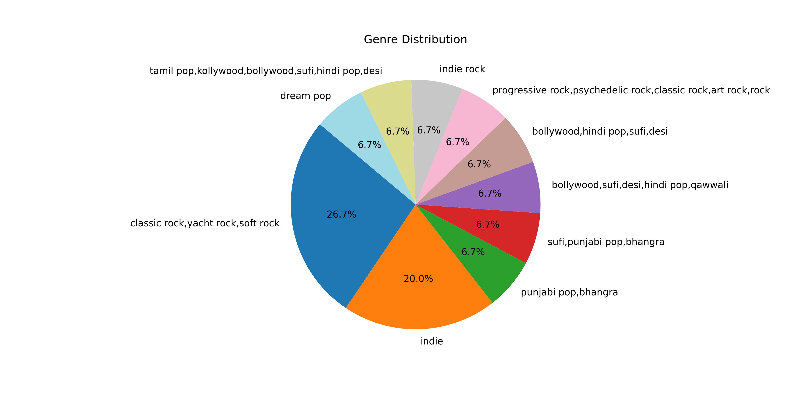

# Spotify Mini Analysis 

This project analyzes Spotify data and visualizes key trends using Python.

## Project Structure
- `bar.py` – Creates bar charts
- `pie.py` – Creates pie charts
- `hist.py` – Creates histograms
- `spotify_clean.csv` – Cleaned Spotify dataset
- `visuals/` – Folder containing generated plots

## Features
- Fetches data from Spotify using Spotipy
- Visualizes top artists, genres, and track features
- Quick insights into Spotify listening trends

## Sample Visualizations

### Bar Chart – Top Artists

### Pie Chart – Genre Distribution

### Histogram – popularity Distribution

## How to Use
1. Clone the repository
2. Install required Python packages (`pandas`, `matplotlib`,`spotipy`, etc.)
3. Run the scripts to generate visualizations in the `visuals/` folder

## Author
Princy Singh

